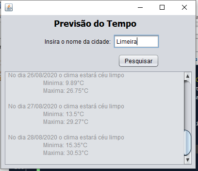

<h1 align="center">
     🌦️️ <a href="#" alt="programa de previsão do tempo"> Previsão do Tempo - Open Weather Maps </a> 🌈
</h1>

<h3 align="center">
    A previsão do tempo, para os próximos sete dias, na cidade que você quiser!
</h3>

    
   

<h4 align="center">
	🚧 Em Andamento 🚧
</h4>

---

Tabela de conteúdos
=================
<!--ts-->
   * [Sobre o projeto](#-sobre-o-projeto)
   * [Funcionalidades](#-Funcionalidades)
   * [Screenshots](#Screenshots)
   * [Como executar o projeto](#-como-executar-o-projeto)
   * [Tecnologias](#-tecnologias)
   * [Contribuidores](#-contribuidores)
   * [Como contribuir no projeto](#-como-contribuir-no-projeto)
   * [Autora](#-autora)
   * [Licença](#user-content--licença)
<!--te-->

---

## 💻 Sobre o projeto

<h4 align="center">🌦️️️ Uma aplicação simples, desenvolvida em Java, para consumir os dados da API <a href="https://openweathermap.org/api">OpenWeatherMap</a>. 🌈 </h4>

Para serem obtidos os dados da previsão do tempo para os próximos 7 dias, são necessários diferentes tipos de requests aps serviços da OpenWeather (API e Rest).
 
Esse projeto é um exercício (e exemplo) da utilização desses dois meio de obtenção de informação, além de fazer um tratamento nos dados para exibir apenas a informação relevante ao usuário final.

---

## ⚙ Funcionalidades

- [x] Exibe a previsão do tempo para qualquer cidade do mundo
  - [x] recebe o nome de uma cidade na interface
  - [x] valida a disponibilidade de dados na api <a href="https://openweathermap.org/api">OpenWeatherMap</a>
  - [x] envia requests HTTP ao endpoint da OWM 
  - [x] trata json com grande quantidade de informações 

---

## Screenshots
 Feita utilizando a biblioteca JPannel.
    
 

---

## 🚀 Como executar o projeto

1. Clonar esse projeto para o repositório local
2. Instalar as dependências utilizando o Maven
3. Buildar e executar em sua IDE de preferência
4. Executar a partir do método main() da classe JFrameHandler

---

## 🛠 Tecnologias

As seguintes ferramentas foram usadas na construção do projeto:

Para leitura e tratamento dos dados:
-   **[OpenWeatherMap API](https://openweathermap.org/api)**
-   **[Gson API](https://github.com/google/gson)**
-   **[OkHttp Api](https://square.github.io/okhttp/)**

Gerenciador de build:
-   **[Maven](https://maven.apache.org/)**

---

## 👨‍💻 Contribuidores

💜 Brigadão de coração pra todo mundo que deu uma ajudinha nesse projeto!

<table>
  <tr>
    <td align="center"><a href="https://github.com/StellaJung-Student"><b>Stella Jung</b></a> ‍⚖️</td>
    <td align="center"><a href="https://github.com/Saharatt593"><b>Saharatt593</b></a> ‍</td>
  </tr>
   <tr>
     <td align="center"><a href="https://github.com/smcveigh941"><b>Stephen McVeigh 🌎</b></a> ‍⚖️</td>
   </tr>
</table>

---

## 💪 Como contribuir no projeto

1. Faça um **fork** do projeto.
2. Crie uma nova branch com as suas alterações.
4. Adicionar suas informações na sessão Contribuidores desse README
5. Salve as alterações e crie uma mensagem de commit contando o que você fez.
6. Envie as suas alterações.
> Caso tenha alguma dúvida confira este [guia de como contribuir no GitHub](./CONTRIBUTING.md)

---

## 🦸 Autora

<a href="https://github.com/claramiranda">
 
  
 <b>Clara Miranda</b></a> <a href="https://www.linkedin.com/in/cannamiranda/" title="Entusiasta">🚀</a>
  

---

## 📝 Licença

Este projeto esta sob a licença [MIT](./LICENSE).

Feito com ❤️ por Clara Miranda 👋🏽 
 [Entre em contato!](https://www.linkedin.com/in/cannamiranda/)

---

##  Versões do README

[Português 🇧🇷](./README.md)  |  [Inglês 🇺🇸](./README-en.md) 
